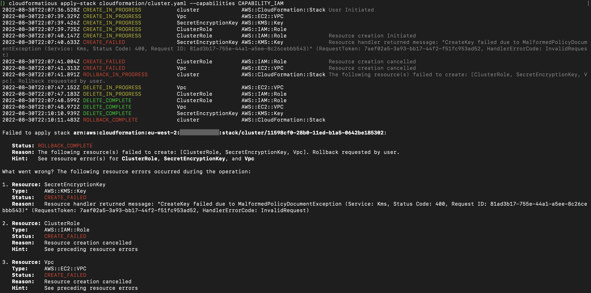

# `cloudformatious-cli`

A CloudFormation CLI that won't make you cry.



```
cloudformatious-cli
A CloudFormation CLI that won't make you cry.

All commands will look for AWS configuration in the usual places. See AWS CLI documentation for more
information: https://docs.aws.amazon.com/cli/latest/topic/config-vars.html

Use `cloudformatious <command> --help` to get more information about individual commands.

USAGE:
    cloudformatious-cli [FLAGS] [OPTIONS] <SUBCOMMAND>

FLAGS:
    -h, --help
            Prints help information

        --quiet
            Disable informational output to STDERR

    -V, --version
            Prints version information


OPTIONS:
        --region <region>
            The region to use. Overrides config/env settings [env: AWS_REGION=]


SUBCOMMANDS:
    apply-stack
            Apply a CloudFormation template.

            This performs an update or create operation for a target stack. It's not an error for
            there to be no changes. The command runs until the stack settles.

            # Output

            Stack events are printed to STDERR as the operation proceeds, unless disabled with
            `--quiet`.

            If the stack operation succeeds and there are no resource errors, then the stack's
            outputs are printed to STDOUT as JSON.

            If the stack operation succeeds and there *are* resource errors, then details of the
            errors are printed to STDERR and the stack's outputs are printed to STDOUT as JSON.

            If the stack operation fails, then details of the error(s) are printed to STDERR.

            # Exit code

            If the stack operation succeeds and there are no resource errors, then the CLI will exit
            successfully with code 0.

            If the operation succeeds but there *are* resource errors, then the exit code is 3.

            If the operation fails because the stack settled in an error state, then exit code is 4.

            If the operation fails for any other reason, then the exit code is 1.
    delete-stack
            Delete a CloudFormation stack.

            # Output

            Stack events are printed to STDERR as the operation proceeds, unless disable with
            `--quiet`.

            If the stack is deleted successfully and there are no resource errors, or if no stack
            existed in the first place, a confirmation message is printed to STDERR.

            If the stack is deleted successfully and there *are* resource errors, then details of
            the errors are printed to STDERR.

            If the stack deletion fails, then details of the error(s) are printed to STDERR.

            # Exit code

            If the stack is deleted successfully and there are no resource errors, or if no stack
            existed in the first place, then the CLI will exit successfully with code 0.

            If the stack is deleted successfully but there *are* resource errors, then the exit code
            is 3.

            If the stack deletion fails because the stack settled in an error state, then exit code
            is 4.

            If the deletion fails for any other reason, then the exit code is 1.
    help
            Prints this message or the help of the given subcommand(s)
```
